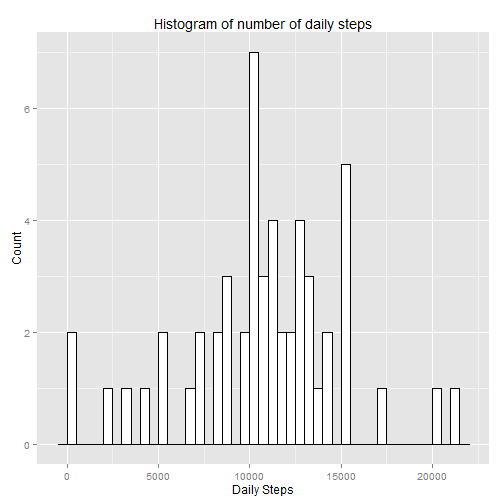
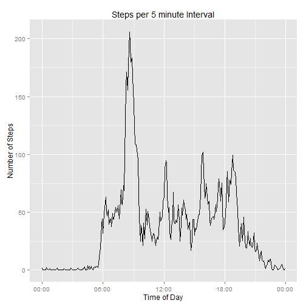
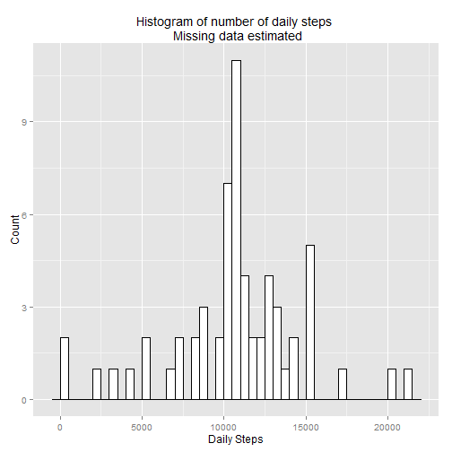
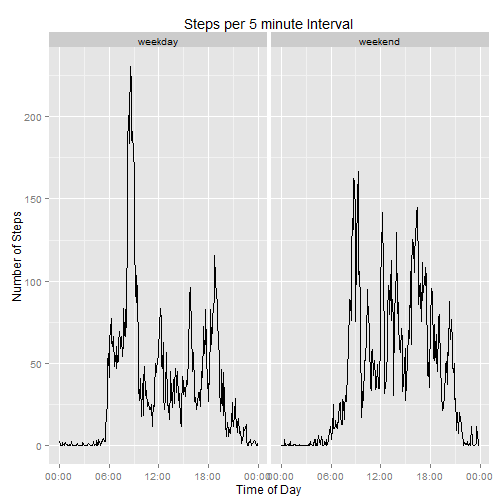

# Introduction
This report analyzes data from activity monitoring devices taken from an anonymous person in October and November of 2012.  All data was obtained, processed, and analyzed using R programming language, R version 3.2.1 (2015-06-18). 

# Data Set
The data for this report was taken from the following link on 2015-07-14.
[Activity Monitoring Data](https://d396qusza40orc.cloudfront.net/repdata%2Fdata%2Factivity.zip). 


```r
# Download data from website, save locally, and read into a data frame.
url <- "https://d396qusza40orc.cloudfront.net/repdata%2Fdata%2Factivity.zip"
if(!file.exists("Activity_Monitoring_Dataset.zip")) {
    download.file(url,destfile = "./Activity_Monitoring_Dataset.zip")
}
unzip("Activity_Monitoring_Dataset.zip")
# Load data
dataset_raw <- read.csv("activity.csv")
```
The data consists of 17568 observations of data.  For each observation, three variables are given:  a date, a time at which a 5 minute interval begins, and the number of steps over the 5 minute interval.  Some observations are missing the number of steps, all of which will be omitted during the first part of the analysis.


```r
## Preprocess data.  Omit NA data and convert the Interval from character to POSIXct.
dataset <- na.omit(dataset_raw)
library(lubridate, quietly = TRUE)
dataset$interval <- parse_date_time(dataset$interval,c("%H$M","%M"))
```
# Analysis
## Mean number of steps per day 
The first part of the analysis calculates the mean number of steps taken per day.  A histogram of the number of steps per day is also presented.

```r
library(dplyr,quietly = TRUE, warn.conflicts = FALSE) #to prevent warning about certain objects being masked.
steps <- summarize(group_by(dataset,date),"sum_steps" = sum(steps))
library(ggplot2, quietly = TRUE)
library(scales, quietly = TRUE)
# Make histogram
g <- ggplot(steps,aes(sum_steps)) + 
    geom_histogram(binwidth = 500,fill="white",color="black") + 
    ggtitle("Histogram of number of daily steps") + xlab("Daily Steps") + ylab("Count")
print(g)
```

 

- The mean number of steps taken each day is 10766.19.  
- The median number of steps taken each day is 10765

## Activity Pattern
The next part of the analysis focuses on the individual's activity pattern throughout the day.  A time series plot of the average number of steps taken at each interval throughout the 24 hour day appears below.

```r
steps_5min <- summarize(group_by(na.omit(dataset),interval),"mean_steps" = mean(steps))
g <- ggplot(steps_5min,aes(interval,mean_steps)) + 
    geom_line() + 
    scale_x_datetime(labels = date_format("%H:%M")) +
    ggtitle("Steps per 5 minute Interval") + xlab("Time of Day") + ylab("Number of Steps")  
print(g)
```

 

```r
max_steps <- max(steps_5min$mean_steps)
max_step_interval <- steps_5min$interval[which(steps_5min$mean_steps == max_steps)]
```
From the plot, it is apparent that there is a burst of activity in the morning.  The peak activity occurs, on average, at the 5 minute interval beginning at 08:35:00.

## Estimating missing values
This section attempts to address the impact of the missing data on analysis.  There are 2304 missing observations, accounting for 13.1% of the observations.

Each missing observation will be taken to be equal to the average number of steps at that same interval in the day, calculated across all days for which data exists. 


```r
dataset2 <- dataset_raw
dataset2$interval <- parse_date_time(dataset_raw$interval,c("%H$M","%M"))
# Merge raw dataset with missing values with data frame containing mean number of steps at each daily interval
dataset2 <- merge(dataset2,steps_5min,by = "interval")  
# Fill in mising values, remove last two columns
dataset2 <- mutate(dataset2,steps = ifelse(is.na(steps),mean_steps,steps))[,c(-4,-5)]
```
## Histogram of steps using revised data set

A new histogram of daily steps is presented using the full data set with missing data estimated per the previous section.

```r
steps <- summarize(group_by(dataset2,date),"sum_steps" = sum(steps)) #repeat histogram with 
g <- ggplot(steps,aes(sum_steps)) + 
    geom_histogram(binwidth = 500,fill="white",color="black") + 
    ggtitle("Histogram of number of daily steps \n Missing data estimated") + xlab("Daily Steps") + ylab("Count")
print(g)
```

 

- The mean number of steps is 10766.19.
- The median number of steps is 10766.19.

Note that the mean number of steps is unchanged from the calculation with missing data omitted.  The median is also nearly the same (within 1 step.) 

## Differences between weekday and weekend activity
This section looks at the data separated into two categories:  
1.  Weekday (Monday through Friday)  
2.  Weekend (Saturday and Sunday) 


```r
# Create factor variable with two levels, "weekend"" and "weekday""
dataset2 <- mutate(dataset2,part_of_week = ifelse(weekdays(as.POSIXct(date),abbreviate = FALSE) %in% c("Saturday","Sunday"),"weekend","weekday"))
dataset2$part_of_week <- factor(dataset2$part_of_week,levels = c("weekday","weekend"))     
# Make panel plot of number of steps versus time of day, across weekend / weekday.
steps_5min <- summarize(group_by(dataset2,interval,part_of_week),"mean_steps" = mean(steps))
g <- ggplot(steps_5min,aes(interval,mean_steps)) + 
    geom_line() + 
    facet_grid(. ~ part_of_week) + 
    scale_x_datetime(labels = date_format("%H:%M")) +
    ggtitle("Steps per 5 minute Interval") + xlab("Time of Day") + ylab("Number of Steps")  
print(g)
```

 

# Conclusion
This report documents only a very cursory exploration and analysis of the data.  Further analysis may uncover interesting trends and observations and is highly recommended.    
   
    
    
